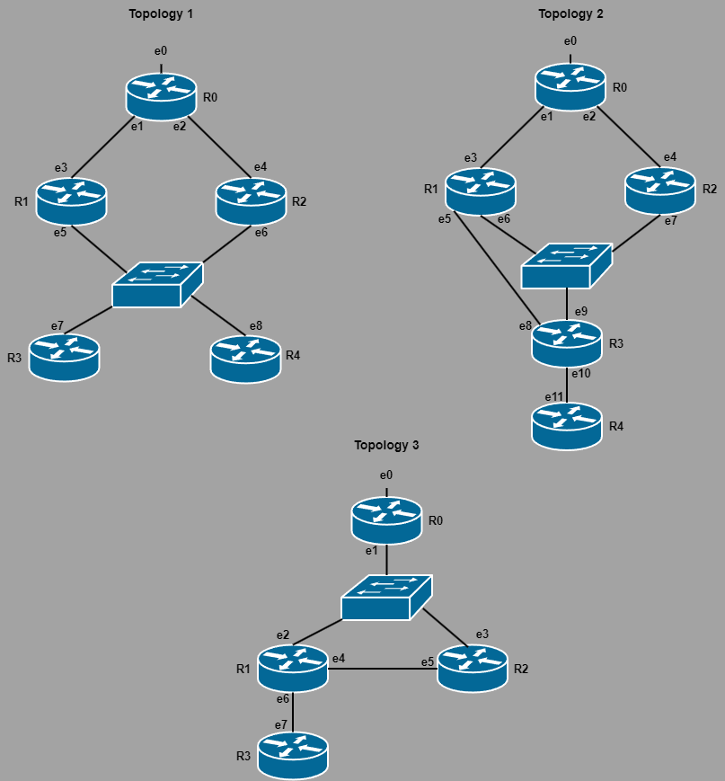

# Model Checking: Promela

#### How to perform tests:
```
spin -a FILE_NAME.pml
gcc -O2 -o pan pan.c -DCOLLAPSE -DVECTORSZ=15000
./pan -a
```

#### Tests:
We have performed tests using Promela and Spin on the state machines of the creation, maintenance, and removal of trees.

##### Creation of the Tree:

 These tests verify if the tree is created correctly, meaning that all routers eventually reach the desired state.


 |   | File Name | Test description Topology 1 |
 |:---:|:---:|:---:|
 | 1 | [build_tree_r4.pml](./Build_Tree/R4_in/build_tree_r4.pml) | Tree creation when only router R4 is interested |
 | 2 | [build_tree_r4_r3.pml](./Build_Tree/R3_R4_in/build_tree_r4_r3.pml) | Tree creation when R3 and R4 are interested |

 |   | File Name | Test description Topology 3 |
 |:---:|:---:|:---:|
 | 1 | [tree_creation_with_loop.pml](./Build_Tree/Loop/tree_creation_with_loop.pml) | Tree creation in the presence of a network loop |
 
##### Maintenance of the Tree:

 These tests verify if the tree is created correctly, meaning that all routers eventually reach the desired state when there is a need for reconfigurations.

 |   | File Name | Test description Topology 1|
 |:---:|:---:|:---:|
 | 1 | [interface_role_change.pml](./Maintain_Tree/Interface_Role_Change_R2/interface_role_change.pml) | Maintenance of the tree with interface role change in R2 |
 | 2 | [change_PAW_r4.pml](./Maintain_Tree/Change_PotentialAW_R4/change_PAW_r4.pml) | Maintenance of the tree with changes in the Potential AW of R4 |
 | 3 | [change_RPC_r1.pml](./Maintain_Tree/Change_RPC_R1/change_RPC_r1.pml) | Maintenance of the tree with changes in the RPC of R1 |

 |   | File Name | Test description Topology 2 |
 |:---:|:---:|:---:|
 | 1 | [interface_failure_role_change.pml](./Maintain_Tree/Interface_Failure_and_Role_Change_R3/interface_failure_role_change.pml) | Maintenance of the tree with interface e8 failure causing interface e9 to become root |
 

##### Removal of the Tree:

 These tests verify if the tree is correctly removed.

 |   | File Name | Test description Topology 1|
 |:---:|:---:|:---:|
 | 1 | [remove_tree_r3_r4_stays.pml](./Remove_Tree/R3_R4_in_and_R3_removed/remove_tree_r3_r4_stays.pml) | Removal of R3 from the tree |
 | 2 | [remove_tree_r4_r3_stays.pml](./Remove_Tree/R3_R4_in_and_R4_removed/remove_tree_r4_r3_stays.pml) | Removal of R4 from the tree |

 |   | File Name | Test description Topology 3 |
 |:---:|:---:|:---:|
 | 1 | [tree_removal_with_loop.pml](./Remove_Tree/Loop/tree_removal_with_loop.pml) | Tree removal in the presence of a network loop |

##### Network Topologies:

 In all topologies each router's root interface was selected manually, as were the Potential AWs.
 In topology 1, router R0 is the potential AW of routers R1 and R2, whereas routers R1 and R2 are the potential AW of routers R3 and R4, respectively. Router R1 has a better RPC than router R2. Router R0 is connected to a source through interface e0. 

 In topology 2, router R0 is the potential AW of routers R1 and R2, router R1 is the potential AW of router R3, and router R3 is the potential AW of R4. Interface e8 is the root interface of router R3.
 
 In topology 3, router R0 is the potential AW of router R1, router R1 is the potential AW of routers R2 and R3. Therefore, interface e5 is the root interface of router R2.
 
 