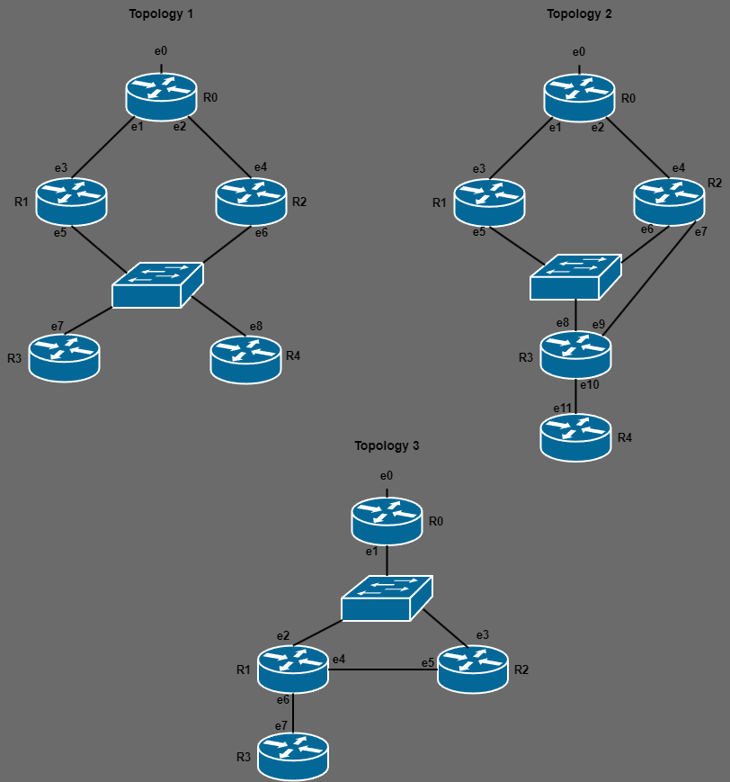

# Model Checking: Promela

#### How to perform tests:
```
spin -a FILE_NAME.pml
gcc -O2 -o pan pan.c -DCOLLAPSE -DVECTORSZ=15000
./pan -a
```

#### Tests:
We have performed tests using Promela and Spin to the state machines of the creation, maintenance, and removal of trees.

##### Creation of the Tree:

 These tests verify if the tree is created correctly meaning that all router eventually reach the desired state.


 |   | File Name | Test description |
 |:---:|:---:|:---:|
 | 1 | [build_tree_r4.pml](./Build_Tree/R4_in/build_tree_r4.pml) | Tree creation when only router R4 is interested |
 | 2 | [build_tree_r4_r3.pml](./Build_Tree/R3_R4_in/build_tree_r4_r3.pml) | Tree creation when R3 and R4 are interested |
 
##### Creation of the Tree:

 These tests verify if the tree is created correctly meaning that all router eventually reach the desired state when there is a need for reconfigurations.

 |   | File Name | Test description |
 |:---:|:---:|:---:|
 | 1 | [interface_role_change.pml](./Maintain_Tree/Interface_Role_Change_R2/interface_role_change.pml) | Maintenance of the tree with interface role change in R2 |
 | 2 | [change_PAW_r4.pml](./Maintain_Tree/Change_PotentialAW_R4/change_PAW_r4.pml) | Maintenance of the tree with changes in the Potential AW of R4 |
 | 3 | [change_RPC_r1.pml](./Maintain_Tree/Change_RPC_R1/change_RPC_r1.pml) | Maintenance of the tree with changes in the RPC of R1 |

##### Removal of the Tree:

 These tests verify if the tree is correctly removed.

 |   | File Name | Test description |
 |:---:|:---:|:---:|
 | 1 | [remove_tree_r3_r4_stays.pml](./Remove_Tree/R3_R4_in_and_R3_removed/remove_tree_r3_r4_stays.pml) | Removal of R3 from the tree |
 | 2 | [remove_tree_r4_r3_stays.pml](./Remove_Tree/R3_R4_in_and_R4_removed/remove_tree_r4_r3_stays.pml) | Removal of R4 from the tree |

 